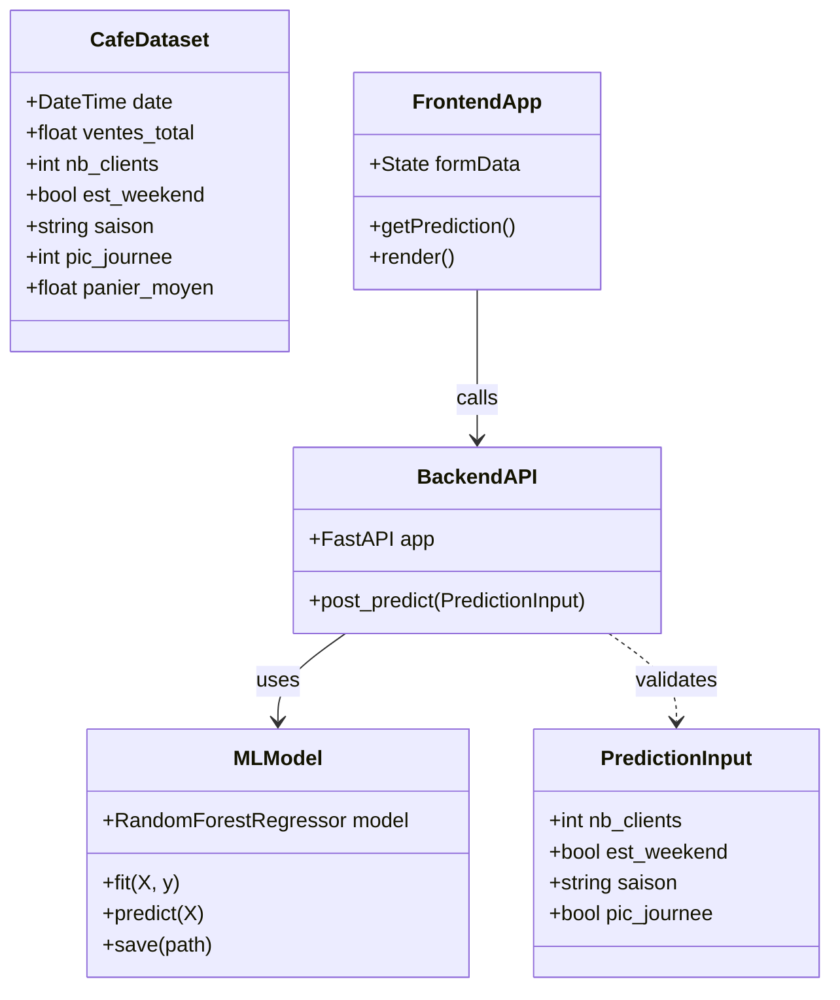

# Diagramme de Classes (UML)

```mermaid
classDiagram
    class CafeDataset {
        +DateTime date
        +float ventes_total
        +int nb_clients
        +bool est_weekend
        +string saison
        +int pic_journee
        +float panier_moyen
    }

    class MLModel {
        +RandomForestRegressor model
        +fit(X, y)
        +predict(X)
        +save(path)
    }

    class PredictionInput {
        +int nb_clients
        +bool est_weekend
        +string saison
        +bool pic_journee
    }

    class BackendAPI {
        +FastAPI app
        +post_predict(PredictionInput)
    }

    class FrontendApp {
        +State formData
        +getPrediction()
        +render()
    }

    BackendAPI --> MLModel : uses
    BackendAPI ..> PredictionInput : validates
    FrontendApp --> BackendAPI : calls
```
