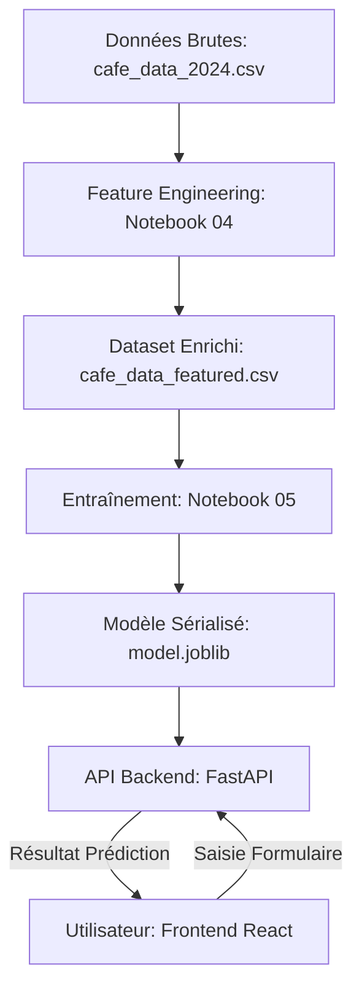

# Workflow ML Pipeline

```mermaid
graph TD
    A[Données Brutes: cafe_data_2024.csv] --> B[Feature Engineering: Notebook 04]
    B --> C[Dataset Enrichi: cafe_data_featured.csv]
    C --> D[Entraînement: Notebook 05]
    D --> E[Modèle Sérialisé: model.joblib]
    E --> F[API Backend: FastAPI]
    G[Utilisateur: Frontend React] -- Saisie Formulaire --> F
    F -- Résultat Prédiction --> G
```
